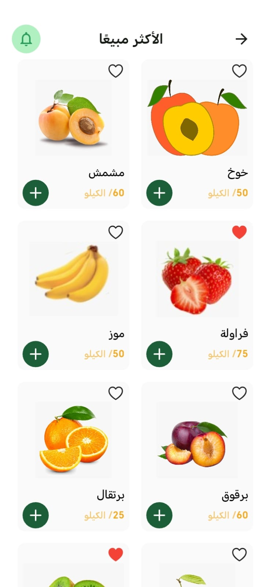
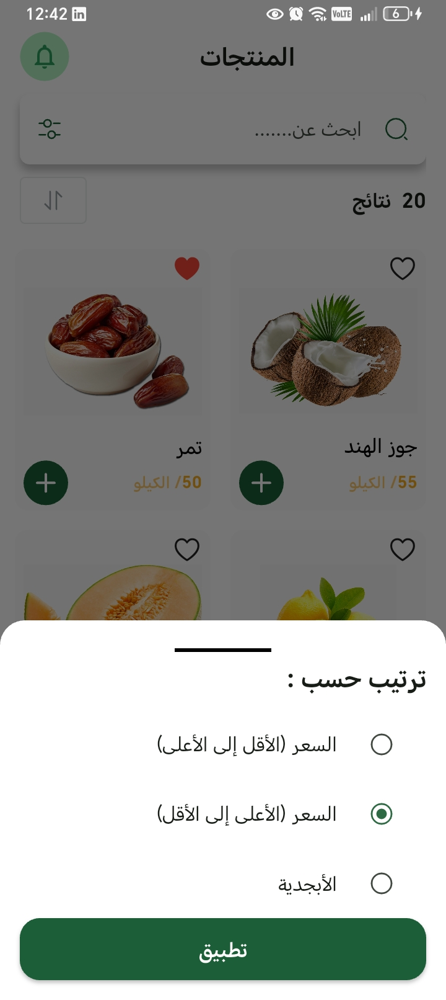
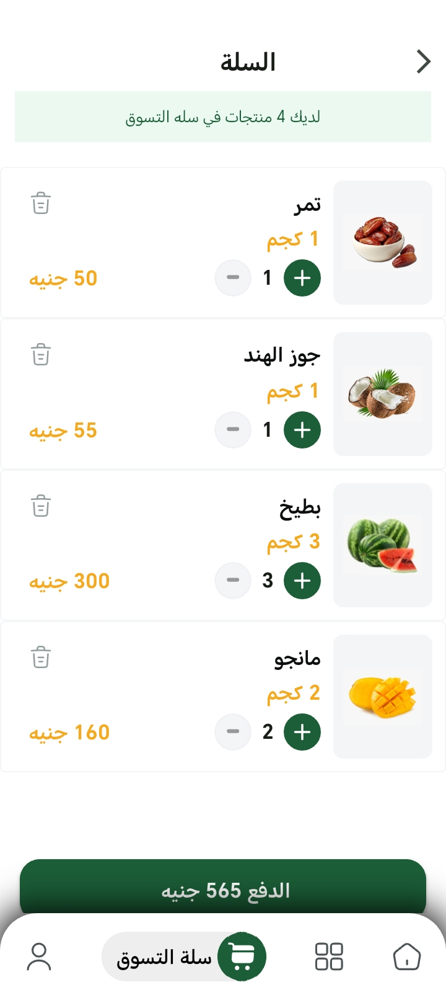

# 🥑 Fruit Hub - Flutter E-Commerce Application

A modern Flutter E-Commerce application for fruit shopping, built with a strong focus on **Clean Architecture**, scalability, maintainability, and clean code practices.

🎥 **Demo Video:**
https://youtu.be/0FP8SnyFT44?si=8YA1J1m1pi2Kch2H

---

## 🚀 Features

### 🔐 Authentication

* Email & Password Authentication
* Google Sign-In
* Facebook Login
* Apple Sign-In
* Password Recovery via Email

### 🛍️ Product Management

* Browse Products
* Search Products
* Best-Selling Products
* Product Sorting
* Favorites Management

### 🛒 Cart & Checkout

* Add & Remove Products
* Quantity Management
* Real-Time Price Updates
* Order Summary
* Payment Method Selection
* Order Confirmation

### 👤 User Profile

* Profile Image Upload
* Personal Information Management
* Password Update
* Order History
* Dark & Light Mode Support
* Secure Sign Out

---

## 📸 Screenshots

### Authentication

| Login                              | Sign Up                             |
| ---------------------------------- | ----------------------------------- |
|  |  |

### Home & Products

| Home                                   | Top Sales                              |
| -------------------------------------- | -------------------------------------- |
|  |  |

| Products                              | Filter Products                                 |
| ------------------------------------- | ----------------------------------------------- |
|  |  |

### Cart & Checkout

| Cart                              | Payment                                      |
| --------------------------------- | -------------------------------------------- |
|  |  |

| Order Address                              | Order Confirmation                        |
| ------------------------------------------ | ----------------------------------------- |
|  |  |

### Profile

| Profile                              | Profile Details                              |
| ------------------------------------ | -------------------------------------------- |
|  |  |

| Previous Orders                          | Sign Out                                         |
| ---------------------------------------- | ------------------------------------------------ |
|  |  |

### Settings & Other Screens

| Dark Mode                              | About Us                              |
| -------------------------------------- | ------------------------------------- |
|  |  |

---

## 🏗️ Architecture

This project follows **Clean Architecture** principles with a clear separation of concerns.

### Project Layers

```text
/
│
├── core/
│
├── features/
│   ├── auth/
│   ├── home/
│   ├── cart/
│   ├── checkout/
│   ├── profile/
│   └── ...
│
└── main.dart
```

### Benefits

* Scalable Architecture
* Easy Maintenance
* Better Testability
* Separation of Concerns
* Improved Code Reusability

---

## 🛠️ Tech Stack

* Flutter
* Dart
* Firebase Authentication
* Cloud Firestore
* Cubit (State Management)
* GetIt (Dependency Injection)
* Shared Preferences
* Google Sign-In
* Facebook Login
* Apple Sign-In

---

## 📚 What I Learned

Through this project, I strengthened my knowledge of:

* Clean Architecture
* SOLID Principles
* State Management using Cubit
* Dependency Injection using GetIt
* Firebase Integration
* Scalable Flutter Application Development
* Clean Code Practices

---

## ⚙️ Getting Started

### Clone Repository

```bash
git clone https://github.com/MohamedRafat-hub/fruit-hub-ecommerce.git
```

### Install Dependencies

```bash
flutter pub get
```

### Run Application

```bash
flutter run
```

---

## 👨‍💻 Author

**Mohamed Rafat**

Flutter Developer

GitHub:
https://github.com/MohamedRafat-hub
